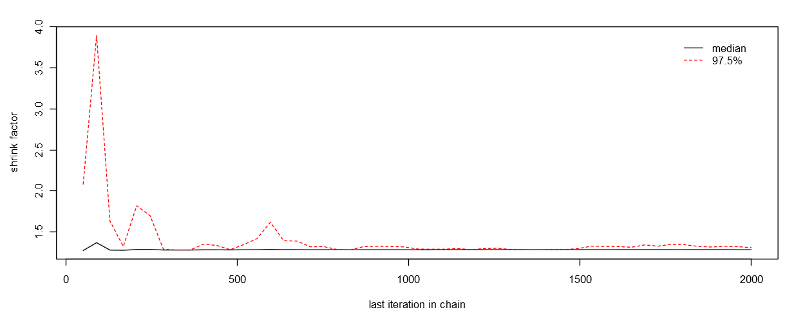
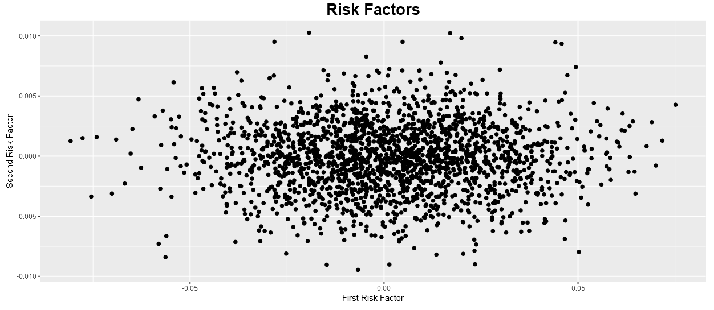
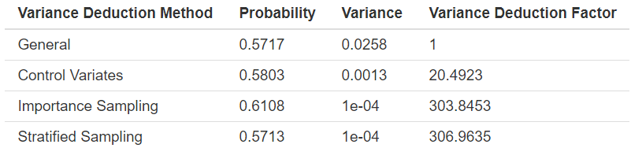

```{r set-options, include = FALSE}
# set default code options
knitr::opts_chunk$set(
  # center images
  fig.align = "center", 
  # to display code set to True
  echo = FALSE,
  # suppress message
  message = FALSE,
  # supress warning
  warning = FALSE
)
```

```{r install-and-load-packages, include = FALSE}
# require packages
pkg_list = c('knitr', 'kableExtra', 'magrittr', 'bookdown', 'matrixcalc', 'matlib', 'MASS', 'stringr', 'coda','ggplot2')
# check install
to_install_pkgs = pkg_list[!(pkg_list %in% installed.packages()[,"Package"])]
# install missing packages
if(length(to_install_pkgs)) {
  install.packages(to_install_pkgs, repos = "https://cloud.r-project.org")
}
# load all packages
sapply(pkg_list, require, character.only = TRUE)
```

<!-- Force a new page -->
\newpage

# Introduction
Risk management is always an important task in financial field. Financial institutions have to pay attention to the possible risk they will carry on, especially the potential loss and the chances such loss will happen. It is important for banks and insurance companies to estimate and manage the risk to avoid the situation when there is capital deficiency. Therefore, we need to etstimate the capital requirement accurately according the market risk. Value at Risk (VAR) is a measure for the risk of investments loss, which estimates how much value a investment portfolio might lose at given market conditions. 

Two types of problems are often encompassed by a company when measuring the risk. The first one is how the value of market risk will change according to risk factors (e.g. interest rate). The other one is what in fluence the risk will pose on the value of a portfolio. 

This project is intended to develope a model to revalue the portfolio with the interest rate by starting from the simple linear assumption to quadratic model and make use of revalued portfolio to estimate Value at Risk(VAR). The technique problem we are facing is how to make our estimate much more precise,which means we should do variance reduction for our estimator of VAR. 

In this project, we applied various methods from the class to improve our estimation accuracy and obtain a more accuracy estimation of the VAR.

We can build the model by following steps.

First, we assume the market risk follows multivariate normal distribution with the population mean equals to 0.
We denote the vector of market prices and rates as $S$, $S \sim \mathcal{N}(0, \Sigma_S)$ and $\Sigma_S$ is the covariance matrix of $\Delta S$. 
$$\Delta t = \texttt{risk-measurement horizon}$$

$$\Delta S = \texttt{change in S over interval } \Delta t$$


Then we will obtain the variance from the history data. To generate random variables following the expected distribution, we use MCMC to sample the objective distribution. After generating random variables with the multivariate normal distribution by MCMC, we can use this statistics to evaluate the change of the portfolio value in certain time intervals.

Since the $\Delta V$ is linear in $\Delta S$, we can perform linear transformation to sample the random variable $\Delta V$. 
$$\Delta V = \delta^T \Delta S$$

$\delta^T$ is the linear transformation matrix.


Then by relevant financial knowledge, we can set up the linear transformation as following, which is also called Delta-Gamma Approximation.

$$\Delta V \approx \frac{\partial V}{\partial t}\Delta t + \delta^{\top}\Delta S + \frac{1}{2}\Delta S^{\top}\Gamma \Delta S$$
where
$$\delta_{i} = \frac{\partial V}{\partial S_{i}}, \Gamma_{ij}=\frac{\partial ^{2}V}{\partial S_{i} \partial S_{j}}$$      
Without considering the market price changes and other details, the loss over such interval will be the negative of the change of the portfolio value.
 
Then our task is find the value of L in a certain quantile which represents the loss under certain possibility.
$$L = \texttt{loss over interval }\Delta t$$


Then our estimator which is the VAR should be obtained by getting the percentile of the portfolio's loss distribution.
$$1 - F_L(x_p) = P(L>x_p)$$

In our project, we set the significant level to be 0.01 which means our are going to find the value of the loss distribution with the tail of this value is 0.01. 

However, the estimation of loss value may have a large variance. Hence we use several methods related to Mento Carlo to reduce the variance which is the main goal of our project.
The relevant methods we have learnd form class including importance sampling, stratified sampling, control variable.
In this project, we will perform each method and compare their efficiency in reducing the variance and improving accuracy.


# Method
In order to estimate the risk, which is $P(L > x)$, we should propose assumptions on the portfolio and the distribution of risk factors.   
Assumption:  
1. $$\Delta V 	\approx \frac{\partial V}{\partial t}\Delta t + \delta^{\top}\Delta S + \frac{1}{2}\Delta S^{\top}\Gamma \Delta S$$   
where  
$$L = -\Delta V$$
$$\delta_{i} = \frac{\partial V}{\partial S_{i}}, \Gamma_{ij}=\frac{\partial ^{2}V}{\partial S_{i} \partial S_{j}}$$   

2. $$\Delta S \sim N(\mu, \theta)$$   

For the first assumptions, it explains the approxiamtely quadractic relation betwee risk factor and the loss function, which is called Delta-Gamma Approximation. This is format is deduced from the Taylor Expansion. The another assumption is a basic idea behind the model, which can explain most situation of the risk factor situation. 

Therefore, in our model, the random variable is the $\Delta S$, which is multi-normal distribution. We make use of MCMC method to generate it. Then we utilize the Delta_gamma Method to to revalue the portforlio. With the loss function, bootstrap can be used to estimate the VAR at given risk level. Lastly, to reduce the variance of estimating the risk of the estimated VAR, we realize three mathods, which are Control Variate, Importance Sampling, Stratified Sampling to estimate the risk and the variance.

# MCMC
Since there could be a huge scope of influencial factors to the market risk, the variable $\Delta S$ could be with m dimensional multivariate normal distribution. However, in our project to simplify the question, we just pick 2 dimensions.
\[\Delta S = (X, Y) \sim \mathcal{N} (0, \Sigma_S) = \mathcal{N} \big(\begin{bmatrix} \mu_1 \\ \mu_2\end{bmatrix}, \begin{bmatrix} \sigma_1^2 & \rho \sigma_1 \sigma_2
\\ \rho \sigma_1 \sigma_2 &\sigma_2^2  \end{bmatrix} \big)\]

Then the conditional distribution is:
\[ (X|Y= y) \sim \mathcal{N} \big(\mu_1 + \rho \frac{\sigma_1}{\sigma_2} (y-\mu_2), (1-\rho^2)\sigma_1^2\big) \]

\[ (Y|X= x) \sim \mathcal{N} \big(\mu_2 + \rho \frac{\sigma_2}{\sigma_1} (x-\mu_1), (1-\rho^2)\sigma_2^2\big) \]

Then we are going to generate X and Y by the conditional distribution using gibbs sampling.

# VAR Estimate
In order to estimate the VAR value, we can revalue the Loss function based on the generated $\Delta S$, which is   
$$\Delta V 	\approx \frac{\partial V}{\partial t}\Delta t + \delta^{\top}\Delta S + \frac{1}{2}\Delta S^{\top}\Gamma \Delta S$$   

After generate the Loss function value, we make use of Bootstrap to estimate the quantile of the Loss function with given risk level. The Bootstrp algorithm is below:  

# Variance Reduction Techniques
There are tree methods we use to estimate the estimated VAR's risk. They are Control Variate, Importance Sampling, Stratified Sampling. 

## Control Variate

The method of control variates is among the most effective and broadly applicable techniques for improving the efficiency of Monte Carlo simulation. It exploits information about the errors in estimates of known quantities to reduce the error in an estimate of an unknown quantity.
  
Suppose that the pairs $(X_i,Y_i\ ),i=1,\ 2,\ 3,\ \ldots,\ n$ are i.i.d. and that the expectation E(X) of the $X_i$ is known. Then for any fixed b we can calculate

$$Y_i\ (b)=Y_i-b(X_i-E(X))$$

from the ith replication and then compute the sample mean

$$\bar{Y}\left(b\right)=\bar{Y}-b\left(\bar{X}-E\left(X\right)\right)=\frac{1}{n}\sum_{i=1}^{n}{(Y_i-b(X_i-E(X)))}$$

As an estimator of E(Y), the control variate estimator is unbiased. Each $Y_i\left(b\right)$ has variance

$$Var\left[Y_i\left(b\right)\right]={\sigma_Y}^2-2b\sigma_X\sigma_Y+b^2{\sigma_X}^2$$

The optimal coefficient $b^\ast$ minimizes the variance and is given by

$$b^\ast=Cov(X,Y)Var[X]$$

In our project, we generate ???S as $CZ$ with $Z\ ~\ N(0,\ I)$. Then let $\left(L_i,Q_i\ \right),i=1,\ 2,\ 3,\ \ldots,\ n$, be the values recorded on n independent replications. A control variate estimator of P(L > x) is given by

$$1-\widehat{F_L^{CV}}\left(x\right)=\frac{1}{n}\sum_{i=1}^{n}1\left\{L_i>x\right\}-\hat{\beta}(\frac{1}{n}\sum_{i=1}^{n}1\left\{Q_i>x\right\}-P(Q>x))$$

An estimate $\hat{\beta}$ of the variance-minimizing coefficient can be computed from the $\left(L_i,Q_i\ \right)$ as explained before.
 
## Importance Sampling

In order to realize the Importance Sampling, we should make use of the Delta-Gamma Method and its diagonalized format and the most important thing is to find the importance sampling function. In GHS paper, it gives an optimal importance sampling for estimating the risk. We use its method to realize our algorithm.

The below this the mathematical deduction for the Importance Sampling Method.


$$L \approx a + b^{\top} Z + Z^{\top}\Lambda Z$$
$$= a+ \sum_{j = 1}^{m}(b_j Z_j + \lambda_{j}Z_j^{2} \equiv Q)$$    

In GHS, the importance function shall obey the following rule. The importance function is proportional to the multi-normal distribution, which can chieve a great effect of variance reduction.
$\frac{\partial P_{\theta}}{\partial P} = e^{\theta Q - \phi(\theta)}$

The solution for the above euation is the distribution $Z \sim N(\mu_{\theta}, \Sigma_{\theta})$, where $\Sigma(\theta)$ is diagnostic matrix. Therefore, we can get the following equation with diagonalization format of Delta_Gamma Method.  


$$
\mathcal{P}(Q > x) = E[\mathcal{1}(Q>x)]
                   = E_{\theta}[(\frac{\partial P}{\partial P_{\theta}}) \mathcal{1}(Q>x)] 
                   = E_{\theta}[e^{-\theta Q + \phi(\theta)} \mathcal{1}(Q >x)]
$$
so that 
$$\mathcal{P}(L > x) = E[e^{-\theta Q + \phi(\theta)} \mathcal{1}(L > x)]$$
where
$$Z \sim P_{\theta}$$

The exact distribution of Z is below:  
$$Z \sim N(\mu(\theta), \Sigma(\theta))$$
$$\mu_{j}(\theta) = \frac{\theta b_{j}}{1 - 2\lambda_{j}\theta}$$
$$\sigma_{j}^{2}(\theta) = \frac{1}{1-2\lambda_{j}\theta}$$
Besides, there are some resrtictions for the parameter. $2\lambda \theta < 1$, so that $\phi(\theta) < \infty$

For $e^{-\theta Q + \phi(\theta)}$, we have following expression  
$$\phi(\theta) \equiv a\theta + \sum_{j = 1}^{m}\phi_{j}(\theta) = a\theta + \frac{1}{2}\sum\sum_{j = 1}^{m}(\frac{\theta ^{2}b_{j}^{2}}{1-2\theta\lambda_{j}} - log(1-2\theta\lambda_{j}))$$
In order to decide $\theta$, we can make use of the following equation with uniroot function.

$$
\phi^{'}(\theta_x) = x
$$


## Stratified Sampling

The Stratified Sampling Method is realized based on Importance Sampling with applying it on each strata. So it's how to decide the best strata that matters in this problem

# Result


# Discussion
From the result, we can discover by all the methods, the estimated probability is almost the same. Therefore there is bias in estimating the risk. But from the risk factor column, we can find the variance Importance Sampling and Stratified Sampling is much larger that that of other methods, which shows that we have realize our target to reduce the variance of estimating risk of VAR and it's significant. To compare the effect, we can find the Importance Sampling and Stratified Sampling are the best. Actually, Stratified Sampling shall be much better that Importance Sampling. Since we just choose the few points to cut the region so that the effect is not so significant.

Although we have a 


# Appendix

```{r shiny-plot, out.width = "500px", fig.cap = "Risk Factor", fig.pos = 'H'}

```

```{r shiny-scatter-plot, out.width = "500px", fig.cap="Risk Factor Scatterplot", fig.pos = 'H'}

```

```{r result-table, out.width = "700px", fig.cap = "Probability and Variance Factor Table", fig.pos = 'H'}

```

# References

## Bibliography

*[@MonteCarlo]
*[@VarianceReduction]
